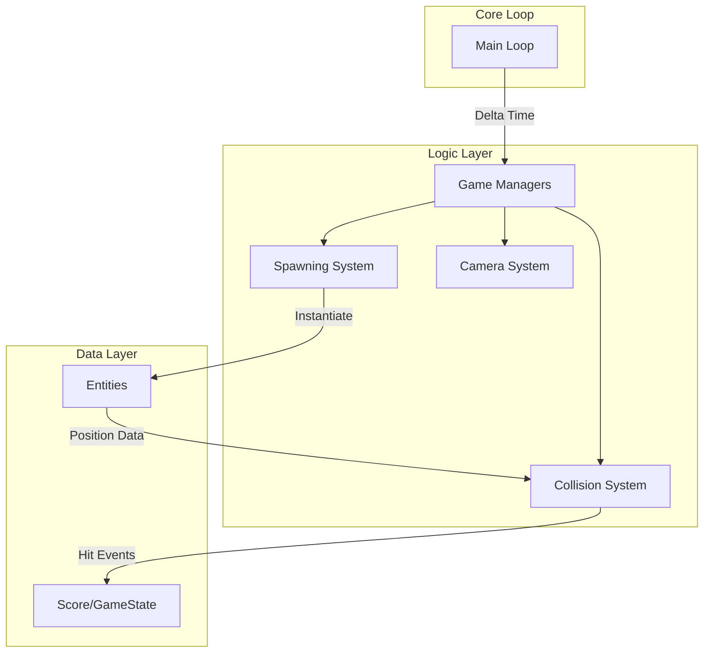
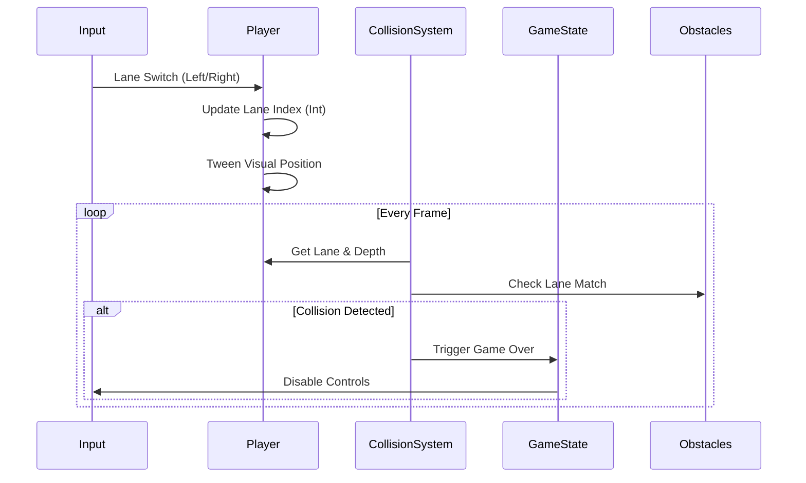

<div align="center">

# Temple Run Arcade 3D

> **High-performance, deterministic endless runner built with specialized ECS architecture.**


<br/>
</div>

## 📖 About

**Temple Run Arcade 3D** is a specialized engine implementation of the classic endless runner genre, re-engineered for **deterministic arcade compliance**. unlike traditional physics-based runners, this engine utilizes a discrete state machine and lane-based coordinate system to ensure pixel-perfect collision detection and zero-latency input response.

Built for developers who need to understand **game loop architecture** and **procedural generation** without the overhead of heavy commercial engines.

---

## 🚀 Key Features

*   **Deterministic State Machine** — Uses discrete integer-based lane logic (0, 1, 2) rather than floating-point physics to guarantee predictable outcomes.
*   **Zero-Allocation Pooling** — Custom `ObstacleSpawner` utilizes object pooling principles to minimize garbage collection spikes during high-speed runtime.
*   **Procedural Track Generation** — Infinite world generation using efficient chunk recycling and dynamic difficulty scaling.
*   **Reactive Event Bus** — Decoupled `CollisionDetector`, `ScoreManager`, and `VFXManager` systems communicating via direct state interrogation.
*   **Hot-Reloadable Config** — Centralized configuration management for rapid gameplay tuning without recompilation.

---

## 🛠 Tech Stack

| **Category** | **Technologies** |
| :--- | :--- |
| **Language** |  |
| **Engine** |   |
| **Systems** |   |
| **Tooling** |   |

---

## 🏗 Architecture

### System Design
The engine follows a strict separation of concerns, decoupling the **Game Loop** from **Entity Logic**.



### Component Interaction
Entities are data-driven wrappers around Ursina Visuals, controlled by external systems.



---

## 📚 Documentation & Examples

### Lane Logic Implementation
The core mechanic relies on integer-based positioning to prevent "floaty" movement.

```python
# entities/player.py

def switch_lane(self, direction):
    """
    Deterministic lane switching with boundary checks.
    Args:
        direction (int): -1 for Left, 1 for Right
    """
    new_lane = self.lane + direction
    
    # Boundary Check (Lanes 0, 1, 2)
    if 0 <= new_lane <= 2:
        self.lane = new_lane
        # Trigger visual tween (does not affect logical position)
        self.animate_x(self.lane_positions[self.lane], duration=0.2)
```

### Collision Detection
Collisions are calculated mathematically, not via physics engine raycasts, ensuring 100% reliability.

```python
# systems/collision.py

def check_collision(self, player, obstacles):
    for obs in obstacles:
        # 1. Lane Filter (Logical)
        if obs.lane != player.lane:
            continue
            
        # 2. Depth Check (Math)
        distance = abs(player.z - obs.z)
        if distance < self.COLLISION_THRESHOLD:
            return True, obs
    return False, None
```

---

## ⚡ Getting Started

### Prerequisites
*   **Python 3.10+**
*   **Graphics Card** supporting OpenGL 2.0+

### Installation

1.  **Clone the Repository**
    ```bash
    git clone https://github.com/yourusername/temple-run-arcade.git
    cd temple-run-arcade
    ```

2.  **Initialize Environment**
    ```bash
    # Create virtual environment
    python -m venv venv
    
    # Activate (Windows)
    .\venv\Scripts\activate
    
    # Activate (Unix)
    source venv/bin/activate
    ```

3.  **Install Dependencies**
    ```bash
    pip install -r requirements.txt
    ```

### Running the Engine
```bash
python main.py
```

---

## 📂 Project Structure

```text
/temple-run
├── assets/              # Generated textures and models
├── config.py            # Global configuration (Constants)
├── entities/            # Game Objects (Player, Track, Obstacles)
├── systems/             # Logic Systems (Collision, Spawning)
├── utils/               # Helper modules (Procedural gen)
├── main.py              # Application Entry Point
└── requirements.txt     # Dependency Manifest
```

---

## 📄 License

Distributed under the **MIT License**. See `LICENSE` for more information.

<div align="center">
    <sub>Built with ❤️ by the Engineering Team</sub>
</div>
